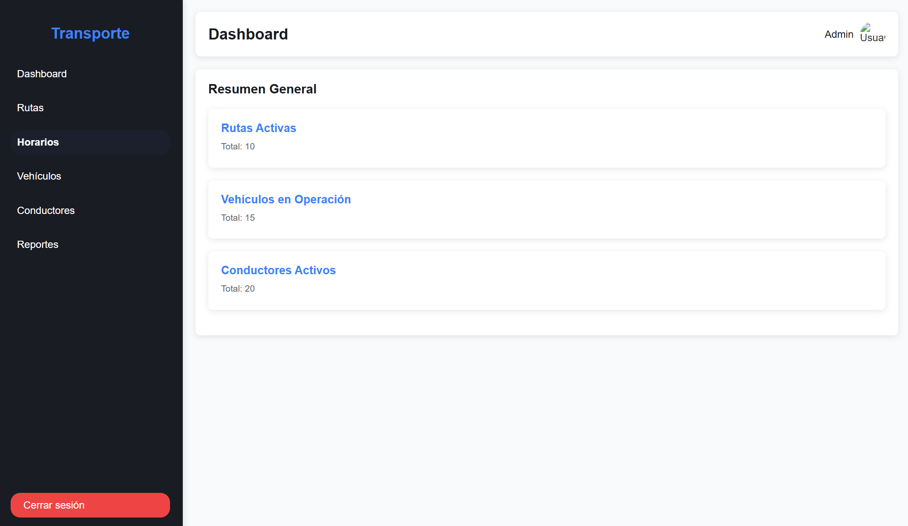
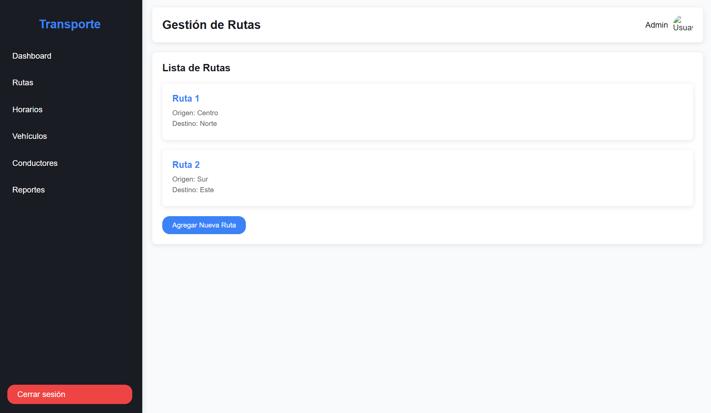
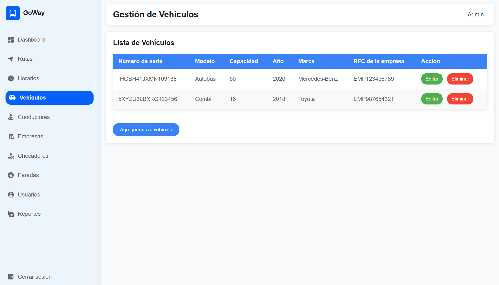
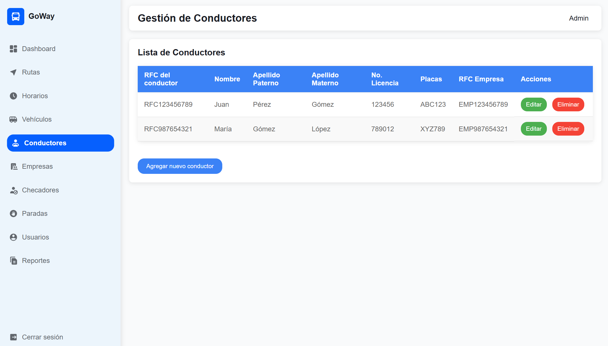
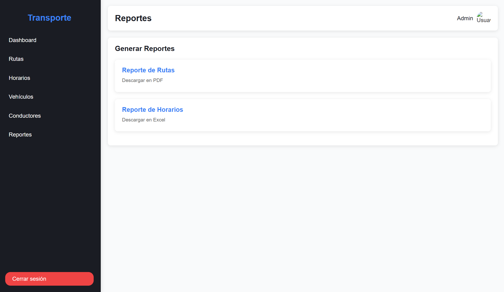

## Tecnologías utilizadas

- **HTML**: Estructura de las páginas.
- **CSS**: Estilos y diseño del dashboard.
- **JavaScript**: Interactividad (opcional, si se agrega en el futuro).

## Cómo usar el proyecto

1. Clona este repositorio o descarga los archivos.
2. Abre el archivo `index.html` en tu navegador (de preferencia en VS Code con LiveServer) para ver el dashboard.
3. Navega entre las diferentes secciones usando el menú lateral.

## Páginas disponibles

- **Dashboard**: Resumen general del sistema.
- **Rutas**: Gestión de rutas de transporte.
- **Horarios**: Visualización y gestión de horarios.
- **Vehículos**: Información sobre los vehículos en operación.
- **Conductores**: Lista de conductores activos.
- **Reportes**: Generación de reportes en PDF o Excel.

## Personalización

Puedes modificar los archivos HTML y CSS para adaptar el dashboard a tus necesidades. Si deseas agregar funcionalidades dinámicas, puedes incluir JavaScript en la carpeta `/assets/js`.

## Capturas de Pantalla

  
*Captura de la página principal del dashboard.*

  
*Captura de la página de rutas.*

  
*Captura de la página de horarios.*

  
*Captura de la página de vehiculos.*

  
*Captura de la página de conductores.*

  
*Captura de la página de reportes*

Creado con ❤️ por [HYDRA. INC].